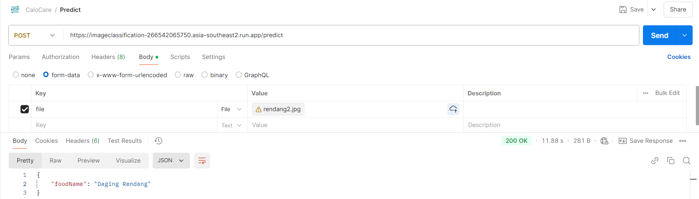

# Calocare Backend API

This is the backend API for **Calocare**, which handles food data, including nutritional information. The API allows adding, retrieving, searching, and deleting food items in the system.

**Recommended testing tool:** [Postman](https://www.postman.com/)

## Base URL

The base URL for the API is:

```
https://calocare-266542065750.asia-southeast2.run.app
```

## API Endpoints

### 1. Add Food (POST /food)

**URL:**  
`https://calocare-266542065750.asia-southeast2.run.app/food`

**Method:**  
`POST`

**Body (raw JSON):**
```json
{
  "food_name": "Apple",
  "carbohydrate": 25.4,
  "protein": 0.5,
  "fat": 0.2,
  "calories": 95,
  "total_nutrition": 95.2,
  "evaluation": "Good"
}
```

**Response:**
```json
{
  "status": "success",
  "message": "Makanan berhasil ditambahkan",
  "data": {
    "foodId": "p7UoYzqVyXq85jzM"
  }
}
```

---

### 2. Show All Food (GET /food)

**URL:**  
`https://calocare-266542065750.asia-southeast2.run.app/food`

**Method:**  
`GET`

**Response:**
```json
[
  {
    "food_name": "Apple",
    "carbohydrate": 25.4,
    "protein": 0.5,
    "fat": 0.2,
    "calories": 95,
    "total_nutrition": 95.2,
    "evaluation": "Good",
    "id": "some-id-generated-by-nanoid"
  },
  {
    "food_name": "Apple two",
    "carbohydrate": 25.4,
    "protein": 0.5,
    "fat": 0.2,
    "calories": 95,
    "total_nutrition": 95.2,
    "evaluation": "Good"
  }
]
```

**Error Response:**
```json
{
  "message": "Gagal mengambil data makanan"
}
```

---

### 3. Show Specified Food by Name (POST /food/search)

**URL:**  
`https://calocare-266542065750.asia-southeast2.run.app/food/search`

**Method:**  
`POST`

**Body (raw JSON):**
```json
{
  "name": "Apple two"
}
```

**Response:**
```json
{
  "status": "success",
  "data": {
    "foods": [
      {
        "id": "p7UoYzqVyXq85jzM",
        "foodName": "Apple two",
        "carbohydrate": 25.023,
        "protein": 0.5,
        "fat": 0.3,
        "calories": 12395,
        "totalNutrition": 25.8,
        "evaluation": "Good",
        "createdAt": "2024-12-03T13:06:40.865Z"
      }
    ]
  }
}
```

---

### 4. Delete Food (DELETE /food/delete-by-name)

**URL:**  
`https://calocare-266542065750.asia-southeast2.run.app/food/delete-by-name`

**Method:**  
`DELETE`

**Body (raw JSON):**
```json
{
  "name": "Apple"
}
```

**Response:**
```json
{
  "message": "Data makanan berhasil dihapus"
}
```

### 5. Analyze Food (POST /predict)

**URL:**  
`https://imageclassification-266542065750.asia-southeast2.run.app/predict`

**Method:**  
`POST`

**Body (form-data):**
```form-data
Key : 'file'

```

**Response:**
```json
{
  "foodName: Daging Rendang"
}
```

**Example Request & Response:**

